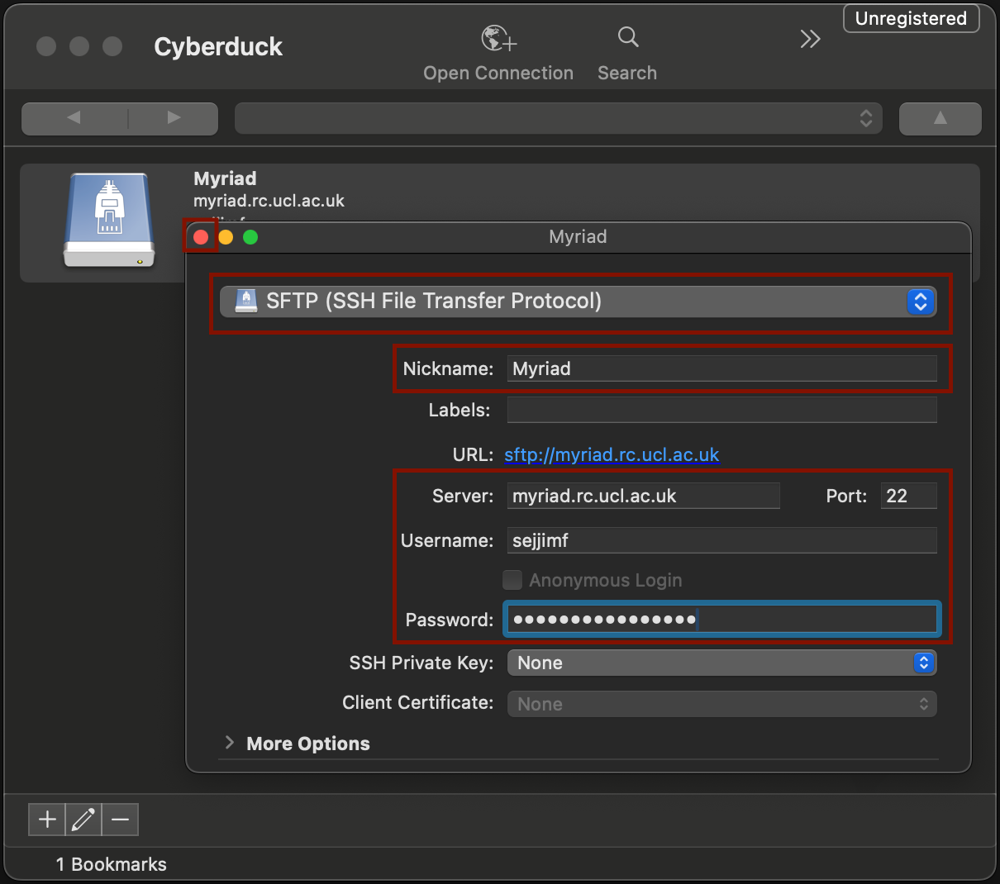
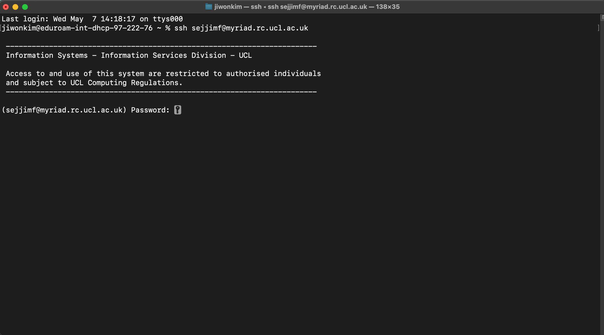

# \[Essential] Setting the computing environment

Before you start, you need to set the computing environment.

**Linux** is an operating system that serves as the foundation for most bioinformatics work. If you're entering bioinformatics, understanding Linux basics is essential as most bioinformatics tools and pipelines run on Linux-based systems. (See [\[Optional\] ARC Workshops](recommended-arc-workshops.md) for more information.)

Linux uses a **command-line interface (CLI)**, which means you interact with the system by typing commands to perform tasks. While this may seem inconvenient at first, it actually enables powerful **automation of large-scale analyses** through scripting.

## How do I get Linux?

You don't need to install it on your local computer, as **UCL provides remote access to Myriad**. Your local machine simply acts as a gateway, allowing you to run analyses on Myriad remotely through your own computer.

All you have to do is [request for Research Computing Account](https://signup.rc.ucl.ac.uk/computing/requests/new) and get your Myriad account activated.

If you have your local server, we recommend using using [**Visual Studio Code** ](https://code.visualstudio.com/)with the **Remote - SSH extension** for easier remote access and file management. We explain how to install **VS Code** [here](../software-setup-on-local-machine/vs-code.md). However, if you're using Myriad, you'll have to use other software as Myriad is incompatible with VS Code.

## How do I access Myriad?

You need software that allows you to connect to Myriad remotely:



<div align="left"><figure><figcaption></figcaption></figure></div>

Mac user can simply use the built-in Terminal application to access Myriad via SSH.

<figure><figcaption></figcaption></figure>

For file transfer, while you can use direct command on your terminal to manage files, we recommend using [Cyberduck](https://cyberduck.io/), which provides graphic interface for **SFTP (SSH File Transfer Protocol)**.

<details>

<summary>How to set up Cyberduck</summary>

1. Install and open Cyberduck.
2.  Click **Bookmark > New Bookmark**.

    <figure><figcaption></figcaption></figure>
3.  Click **SFTP (SSH File Transfer Protocol)** and type the following information in, including **your UCL login information**, and close the windo&#x77;**.**

    <figure><figcaption></figcaption></figure>
4.  Double-click the Myriad bookmark.&#x20;

    <figure><figcaption></figcaption></figure>
5.  If it's your first time connecting to Myriad, you may be asked to allow the fingerprint. Tick **Always** and Click **Allow**.

    <figure><figcaption></figcaption></figure>
6.  You are now connected to Myriad by SFTP. You can upload files to Myriad by drag & drop to the directories.&#x20;

    <figure><figcaption></figcaption></figure>


</details>





Windows users will need extra software to connect to Myriad. While tools like [PuTTY](https://www.putty.org/) provide a terminal emulator and Cyberduck also supports Windows, we recommend using [**MobaXterm**](https://mobaxterm.mobatek.net/), as it serves as both terminal emulator and remote file browser.&#x20;

<details>

<summary>How to set up MobaXterm (Home Edition &#x26; Installer Edition)</summary>

### Setting Up SSH Session

1. Click **Session** (top left).
2. Choose **SSH**.
3. Fill in:
   1. Remote host: `myriad.rc.ucl.ac.uk`
   2. Specify username: your UCL username (e.g., `smgxxxx`)
4. Click **OK** to save and start the session.
5.  Once connected:

    Left side panel: SFTP remote file browser

    Right side: Terminal (command-line access to Myriad)
6. Drag & drop files to the side panel to upload your files to Myriad.

</details>



Once you have terminal (or terminal emulator), you can type the following command to access Myriad. Please replace **\[Your UCL User ID]** with **your actual UCL ID (e.g. smgxxxx)**.

```sh
ssh [Your UCL User ID]@myriad.rc.ucl.ac.uk
```

If you are accessing Myriad **outside of UCL network** (i.e. your home), you should access via **UCL ssh gateway**.

```sh
ssh -J [Your UCL User ID]@ssh-gateway.ucl.ac.uk [Your UCL User ID]@myriad.rc.ucl.ac.uk
```

Type your **UCL password** in when you see this message:

<figure><figcaption></figcaption></figure>


The cursor may not move as you type your password in, but you can keep typing in and press enter when you're done.


You might come across following message:

```
The authenticity of host 'myriad.rc.ucl.ac.uk' port xx: can't be established.
ECDSA key fingerprint is SHA256:<<blahblahblahblahblahblah>>.
Are you sure you want to continue connecting (yes/no)?  
```

This is because you are connecting to Myriad for the first time.

Simply type **yes** in, and you'll be able to access Myriad.


## How do I use the local server?

You don't need to set up Myriad, you can simply access your own server. All you have to know is the I**P address**, **port number**, **your user ID**, and **password**. If you don't have an account, you shall ask a sudo user of the server to create your account.

### IP address/Hostname (e.g., `server.example.com` or `192.168.1.10)`

**IP address** is **a unique numerical label** assigned to a device (like a server) on a network. It is like the **street address** of a house — it tells others where to find the server.

### Port Number

**Port number** specifies a **particular service or application** running on the server. For example, port `22` is usually designated for SSH (remote terminal).  It is like the **flat number** in a building — the IP gets you to the building, the port tells you which room to get in to perform specific task.

### Username & Password

Username & Password are used to identify you from other users on the server. If you use **Myriad**, they are identical as **UCL User ID & Password**. If you are using your lab server, you first need to create a pair by asking **sudo user** of the server, or by logging in to the server as **root** (administrator)**.**


All set, now we are going to learn how to run basic commands and navigate filesystem on Linux in the next session.

