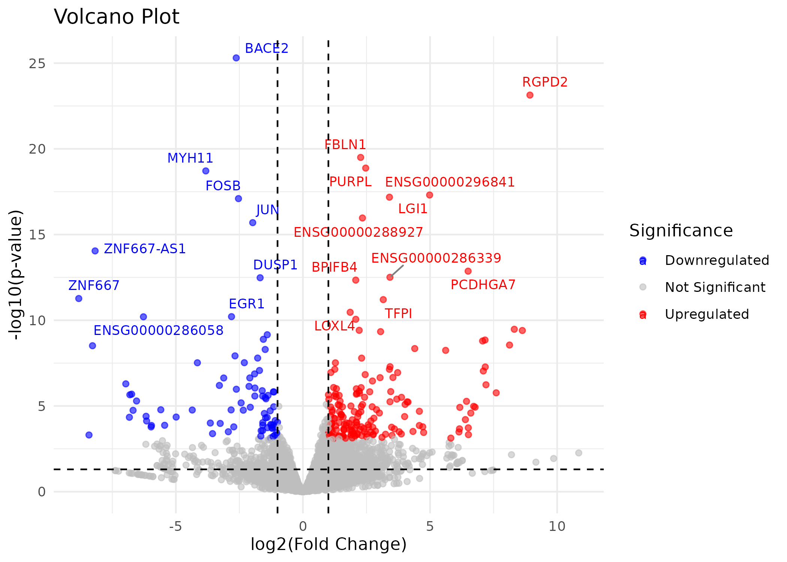
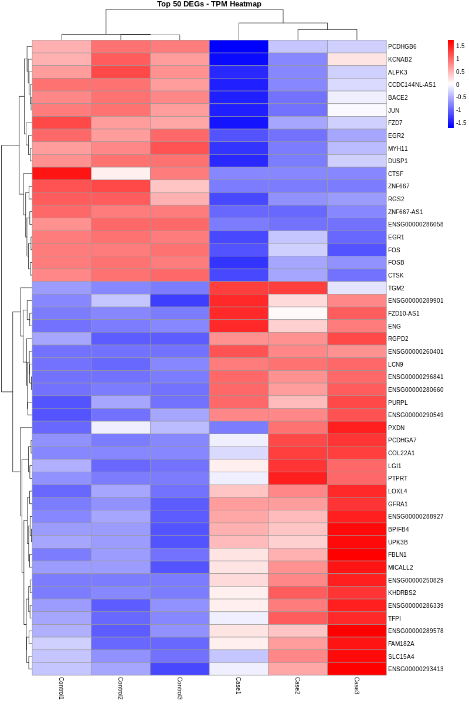

# Bulk RNA sequencing #2: DESeq2

In the previous session,  you quantified the raw gene counts of all of your samples. Here we are going to use that data to identify differentially expressed genes (DEGs) using [DESeq2](https://bioconductor.org/packages/devel/bioc/vignettes/DESeq2/inst/doc/DESeq2.html).&#x20;


First, let's make a subdirectory below our `rnaseq` directory for DESeq2. We are going to run differential analysis in this directory.&#x20;

```sh
## Change into the project directory
cd $HOME/projects/rnaseq
## Make a directory for DESeq2
mkdir -p DESeq2
## Change into DESeq2 directory
cd DESeq2
```

Now let's copy the data into this directory, but without the first column.

```sh
## Copy raw gene counts to current directory
cut -f1 --complement ../result/star_salmon/salmon.merged.gene_counts.tsv  > ./rnaseq_gene_counts.tsv
## Copy TPM to current directory
cut -f1 --complement ../result/star_salmon/salmon.merged.gene_tpm.tsv  > ./rnaseq_gene_tpm.tsv
```

Now we're ready to run DESeq2 on **R**. Let's open R on terminal.&#x20;

```sh
## Load & unload modules do run R
module -f unload compilers mpi gcc-libs
module load r/recommended
module load curl
R
```

<figure><figcaption></figcaption></figure>

Did you notice that **the beginning of the command line** is now `>`, not `(nextflow) [smgxxxx@login12 ~]$`?  Yes, now the terminal is showing you **R prompt**. Now we are going to run an R script for DEG anlaysis!

### 0. Set working directory

```r
##############################
## 0. Set working directory ##
##############################
# Adjust it to where you put rnaseq_gene_counts.tsv
setwd('/myriadfs/home/smgxxxx/projects/rnaseq/DESeq2')
```

### 1. Install and load libraries

```r
###################################
## 1. Install and load libraries ##
###################################
# Create directory for R libraries
dir.create(path = Sys.getenv("R_LIBS_USER"), showWarnings = FALSE, recursive = TRUE)

# Install BiocManager if not installed
if (!requireNamespace("BiocManager", quietly = TRUE)) {
  install.packages("BiocManager", lib = Sys.getenv("R_LIBS_USER"))
}
BiocManager::install(version = "3.16")
library(BiocManager)
# Install DESeq2 if not installed
if (!requireNamespace("DESeq2", quietly = TRUE)) {
  BiocManager::install("DESeq2", lib = Sys.getenv("R_LIBS_USER"), force=TRUE)
}
# Install org.Hs.eg.db (human gene database) if not installed
if (!requireNamespace("org.Hs.eg.db", quietly = TRUE)) {
  BiocManager::install("org.Hs.eg.db", lib = Sys.getenv("R_LIBS_USER"), force=TRUE)
}
# Install clusterProfiler if not installed
if (!requireNamespace("clusterProfiler", quietly = TRUE)) {
  BiocManager::install("clusterProfiler", lib = Sys.getenv("R_LIBS_USER"), dependencies=TRUE, force=TRUE)
}

# Load the libraries
library(DESeq2)
library(org.Hs.eg.db)
library(clusterProfiler)
```

### 2. Import raw gene count

```r
##############################
## 2. Import raw gene count ##
##############################
fp1 <- 'rnaseq_gene_counts.tsv'
fp2 <- 'rnaseq_gene_tpm.tsv'

# Read in raw gene count data and save it to count_data
count_data <- read.csv(fp1,sep="\t",header=TRUE)
count_data <- count_data[!duplicated(count_data$gene_name), ]
rownames(count_data) <- count_data$gene_name
count_data = subset(count_data, select = -c(gene_name))

# Read in normalized gene count data and save it to tpms for heatmap
tpms <- read.table(fp2, header = TRUE, sep = "\t", check.names = FALSE)
tpms <- tpms[!duplicated(tpms$gene_name), ]
rownames(tpms) <- tpms$gene_name
tpms = subset(tpms, select = -c(gene_name))

# Generate metadata (contain sample names and conditions)
metadata <- data.frame(
	sample = colnames(count_data),  # sample name
	condition = sub("[0-9]+$", "", colnames(count_data)) # condition
)
# change rownames of metadata into sample names
rownames(metadata) <- metadata$sample 
```

### 3. Run DESeq2

```r
###########################################
## 3. Run DESeq2 pairwise (GA vs NORMAL) ##
###########################################
# Convert count_data into appropriate format for DESeq2 run and save to dds
dds <- DESeqDataSetFromMatrix(countData = round(count_data), 
                              colData = metadata, 
                              design = ~ condition)
# Set Control group as refrence
dds$condition <- relevel(dds$condition, ref = "Control")    
# Run default DEG analysis with normalization                      
dds <- DESeq(dds)
# Extract differential expression of ALL the genes 
# (including the insignificant ones) to res
res <- results(dds)
# Omit any NA values in padj or log2FoldChange
res <- subset(res, !is.na(padj) & !is.na(log2FoldChange))
# Save the genes with Padj < 0.05 to sig_res (significant genes)
sig_res <- res[res$padj < 0.05,] 
```

### 4. Save results to files with gene name conversion (if required)

```r
########################################################
## 4. Save results to files with gene name conversion ##
########################################################

## Save all results to DESeq2_results/AMDvsControl_DESeq2_Results.csv
name='Case_vs_Control'
of1 <- paste0(name,"_DESeq2_Results.csv")
write.csv(res, of1, row.names = TRUE, quote = FALSE)

df1 <- read.csv(of1, row.names = 1)
gene_list <- df1$log2FoldChange  # Extract log2 fold changes
names(gene_list) <- rownames(df1)  # Assign gene symbols as names
# Convert symbols to official gene symbols
gene_symbol <- bitr(names(gene_list), fromType = "ENSEMBL",
                    toType = "SYMBOL", OrgDb = org.Hs.eg.db)
# Merge with original data
df1 <- merge(df1, gene_symbol, by.x = "row.names", by.y = "ENSEMBL")
# Rearrange columns: move the official gene symbol column to the second
df1 <- df1[, c(1, ncol(df1), 2:(ncol(df1)-1))]
write.csv(df1, of1, row.names = TRUE, quote = FALSE)

## Repeat saving process for significant results
## Save significant results to DESeq2_results/AMDvsControl_DESeq2_Results_logFC1_padj0.05.csv
of2 <- paste0(name,"_DESeq2_Results_padj0.05.csv") 
write.csv(sig_res, of2, row.names = TRUE, quote = FALSE)

df2 <- read.csv(of2, row.names = 1)
names(gene_list) <- rownames(df2)  # Assign gene symbols as names
# Convert symbols to official gene symbols
gene_symbol <- bitr(names(gene_list), fromType = "ENSEMBL",
                    toType = "SYMBOL", OrgDb = org.Hs.eg.db)
# Merge with original data
df2 <- merge(df2, gene_symbol, by.x = "row.names", by.y = "ENSEMBL")
# Rearrange columns: move the official gene symbol column to the second
df2 <- df2[, c(1, ncol(df1), 2:(ncol(df1)-1))]
write.csv(df2, of2, row.names = TRUE, quote = FALSE)
## Get the list of significant genes in Ensembl gene ID format
of3 <-  paste0(name,"DEG_ENSG_list_padj0.05.txt") 
write.table(rownames(sig_res), of3, row.names = FALSE, quote = FALSE, col.names=FALSE)
```

DESeq2 run is done, check `DESeq2_results/Case_vs_Control_DESeq2_Results_padj0.05.csv` for significant genes!

```
less DESeq2_results/GAvsNORMAL_DESeq2_Results_padj0.05.csv
```

### 5. Visualization

Now let's draw volcano plot and heatmap for the DEGs.

```r
#########################################################
## 5. Visualize the data into volcano plot and heatmap ##
#########################################################
# Load libraries
install.packages("pheatmap")
library(ggplot2)
library(pheatmap)
library(dplyr)
library(ggrepel) 

# Read DESeq2 results
res <- read.csv("Case_vs_Control_DESeq2_Results.csv", header = TRUE, row.names = 1)

# Clean and annotate data
res <- res[!is.na(res$padj), ]
res$Significance <- "Not Significant"
res$Significance[res$padj < 0.05 & res$log2FoldChange > 1] <- "Upregulated"
res$Significance[res$padj < 0.05 & res$log2FoldChange < -1] <- "Downregulated"
```

### Volcano plot

A **volcano plot** is a type of scatter plot that shows statistical significance (p-value) versus magnitude of change (fold change) in gene expression, helping to identify genes that are both **significantly and highly differentially expressed between conditions**.

```r
# ---------- VOLCANO PLOT ----------
top20 <- res %>% arrange(padj) %>% head(20)
top20$Gene <- rownames(top20)  # add gene names for labeling

# Volcano plot with labels
volcano_plot <- ggplot(res, aes(x = log2FoldChange, y = -log10(pvalue), color = Significance)) +
  geom_point(alpha = 0.6, size = 1.5) +
  geom_text_repel(data = top20,
                  aes(label = Gene),
                  size = 3,
                  max.overlaps = Inf,
                  box.padding = 0.3,
                  segment.color = "grey50") +
  scale_color_manual(values = c("Upregulated" = "red", "Downregulated" = "blue", "Not Significant" = "grey")) +
  geom_vline(xintercept = c(-1, 1), linetype = "dashed", color = "black") +
  geom_hline(yintercept = -log10(0.05), linetype = "dashed", color = "black") +
  labs(title = "Volcano Plot", x = "log2(Fold Change)", y = "-log10(p-value)") +
  theme_minimal()

# Save volcano plot
ggsave("Volcano_Plot.pdf", volcano_plot, width = 7, height = 5)
ggsave("Volcano_Plot.png", volcano_plot, width = 7, height = 5, dpi = 300)
         
```

<details>

<summary>Example volcano plot</summary>

<figure><figcaption></figcaption></figure>

</details>

### Heatmap

A **heatmap** is a graphical representation of **gene expression levels** across samples, where **colors indicate expression intensity**, allowing easy visualization of patterns, clusters, or differences between conditions.

```r
# ---------- HEATMAP ----------
# Make sure rownames match between TPMs and DESeq2 results
common_genes <- intersect(rownames(tpms), rownames(res))

# Filter to top 50 DEGs (by adjusted p-value)
## Adjust the number of genes if required by changing the number in head() function
top_genes <- res[common_genes, ] %>% arrange(padj) %>% head(50)
heatmap_data <- tpms[rownames(top_genes), ]

# Optionally, log-transform TPMs for better visual contrast
log_tpm <- log2(heatmap_data + 1)

# ---------- Save heatmap ----------
pdf("Heatmap_Top50_genes.pdf", width = 7, height = 10)
pheatmap(log_tpm,
         scale = "row",
         cluster_rows = TRUE,
         cluster_cols = TRUE,
         show_rownames = TRUE,
         show_colnames = TRUE,
         color = colorRampPalette(c("blue", "white", "red"))(50),
         main = "Top 50 DEGs - TPM Heatmap")
dev.off()

png("Heatmap_Top50_genes.png", width = 800, height = 1200)
pheatmap(log_tpm,
         scale = "row",
         cluster_rows = TRUE,
         cluster_cols = TRUE,
         show_rownames = TRUE,
         show_colnames = TRUE,
         color = colorRampPalette(c("blue", "white", "red"))(50),
         main = "Top 50 DEGs - TPM Heatmap")
dev.off()
```

<details>

<summary>Example heatmap</summary>

<figure><figcaption></figcaption></figure>

</details>


Now you have identified which genes are differentially expressed between your sample groups. In the next step, we will run pathway analysis to see which pathways/processes these genes are involved in.

