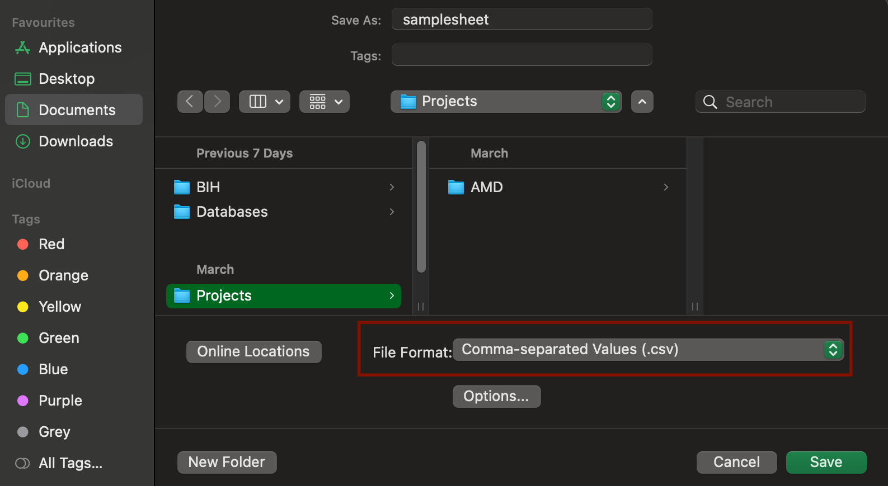

# Bulk RNA sequencing #1: nf-core/rnaseq

We are going to use the **default** setting of [**nf-core/rnaseq**](https://nf-co.re/rnaseq/3.18.0/) in this example.



### Make a project directory & change working directory

```sh
mkdir -p $HOME/projects/rnaseq/data
cd $HOME/projects/rnaseq
```

You should move the raw files into `$HOME/projects/rnaseq/data` directory. Make a `fastq` directory  below `$HOME/projects/rnaseq/data` and transfer raw fastq files into the `$HOME/projects/rnaseq/data/fastq` directory. Click [here](../../handling-files/uploading-raw-data-to-remote-server.md) to see how to upload the raw data.



### Clean file names

Before starting downstream analyses, you have to make the file names concise. We recommend  using a simple file name format such as `[Group][Replicate #]_R1.fq.gz` and `[Group][Replicate #]_R2.fq.gz`.



### Creating an Input File for Nextflow

Nextflow uses a **CSV file** (commonly called a _samplesheet_) to specify sample information and locate input files. Below is an example of a samplesheet containing three control and three patient samples:



sample,fastq\_1,fastq\_2,strandedness\
ctrl1,$HOME/projects/rnaseq/data/ctrl1\_R1.fastq.gz,$HOME/projects/rnaseq/data/ctrl1\_R2.fastq.gz,auto\
ctrl2,$HOME/projects/rnaseq/data/ctrl2\_R1.fastq.gz,$HOME/projects/rnaseq/data/ctrl2\_R2.fastq.gz,auto\
ctrl3,$HOME/projects/rnaseq/data/ctrl3\_R1.fastq.gz,$HOME/projects/rnaseq/data/ctrl3\_R2.fastq.gz,auto\
case1,$HOME/projects/rnaseq/data/case1\_R1.fastq.gz,$HOME/projects/rnaseq/data/case1\_R2.fastq.gz,auto\
case2,$HOME/projects/rnaseq/data/case2\_R1.fastq.gz,$HOME/projects/rnaseq/data/case2\_R2.fastq.gz,auto\
case3,$HOME/projects/rnaseq/data/case3\_R1.fastq.gz,$HOME/projects/rnaseq/data/case3\_R2.fastq.gz,auto



It may look dense at first, but think of it as a simple spreadsheet where columns are separated by commas. In fact, CSV files can be opened and edited in **Excel**.

Each column stands for **the names of the samples**, **the path to the first file of paired-end fastq**, **the path to the second file of paired-end fastq** (you can leave it empty if your data is single-read), and **the strandedness** which you can leave it as **auto** if you are not aware of it.&#x20;

Assuming all your raw data is in the data `data/fastq` directory and had their name has a format of `[[Group][Replicate #]_R1.fastq.gz` or `[Group][Replicate #]_R2.fastq.gz`, you can simply upload this **create\_samplesheet\_140525.sh** file and run it to create the samplesheet.

&#x20;Upload this file to `$HOME/projects/rnaseq` directory, and run it with the following code.



```sh
cd $HOME/projects/rnaseq
## Change the permission to run of the bash script
chmod +x create_samplesheet_140525.sh
## Run the bash script
bash create_samplesheet_140525.sh
```



### Download nf-core rnaseq pipeline

```sh
export NXF_HOME=$HOME/.nextflow
nextflow pull nf-core/rnaseq
```



### Upload Nextflow configuration file

Configuration file is required to run Nextflow script smoothly. Download the file below and add it to your working directory,  `$HOME/projects/rnaseq`.





### Run the pipeline

Upload this file to `$HOME/projects/rnaseq` and submit the job using `qsub`.





\#!/bin/bash -l

\#$ -N rnaseq

\#$ -l h\_rt=48:0:0

\#$ -l mem=6G

\#$ -pe smp 12


cd $HOME/projects/rnaseq


module load python/miniconda3/24.3.0-0

source $UCL\_CONDA\_PATH/etc/profile.d/conda.sh&#x20;

conda activate nextflow

source \~/.bashrc

conda config --add channels bioconda

<br>

export TOWER\_ACCESS\_TOKEN=eyJ0aWQiOiAxMDk1Nn0uMzI1YjJhZWY1ODEzODVmY2FjZTFiZjRjYzFlZGQ5NGZjNDE1MGI1MQ==

<br>

nextflow run nf-core/rnaseq \\

-r dev \\

-profile conda \\

-c nextflow.config \\

\--input samplesheet.csv \\

\--outdir result \\

\--gtf $HOME/ACFS/ref/GRCh38.gtf \\

\--fasta $HOME/ACFS/ref/GRCh38.fa \\

-with-tower&#x20;



```sh
## Change the permission
chmod +x rnaseq.sh
## Submit it as a job to Myriad cluster
qsub rnaseq.sh
## Check the status of the job
qstat
```

<figure><figcaption></figcaption></figure>



### Retrieve gene count results

After the pipeline has finished running, you'll find the unnormalized gene-level read counts in the file: `$HOME/projects/rnaseq/result2/star_salmon/salmon.merged.gene_counts.tsv`.

This tab-separated file contains raw read counts for each gene across all your case and control samples. In the next session, we’ll use this file to perform differential expression analysis using the [**DESeq2**](https://bioconductor.org/packages/devel/bioc/vignettes/DESeq2/inst/doc/DESeq2.html) package in R.






#### Manually creating the samplesheet using Excel

To create your own samplesheet:



Download and open the template file `samplesheet.csv` in Excel.



<figure><figcaption></figcaption></figure>



Fill in the table according to your sample information. Make sure the paths in the `fastq_1` and `fastq_2` columns point to the precise paths of your FASTQ files.

<figure><figcaption></figcaption></figure>



Save the file as `samplesheet.csv`.

<figure><figcaption></figcaption></figure>



Upload this file to your working directory at:\
`$HOME/projects/rnaseq`



