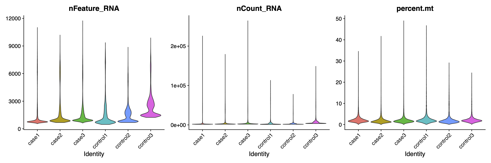
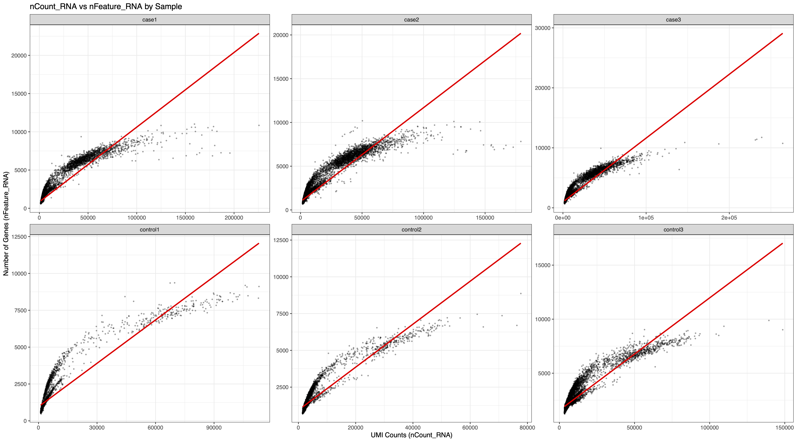
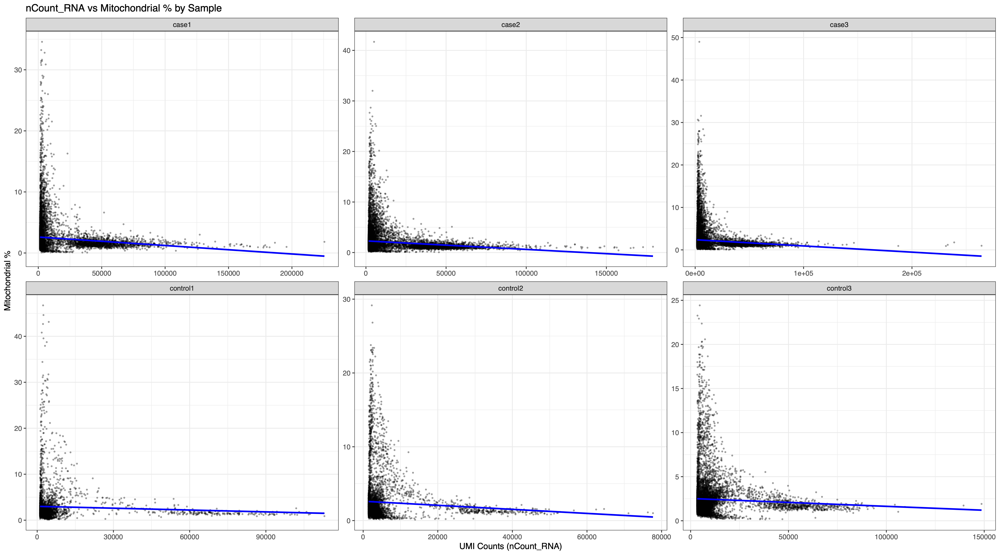

# Single-cell RNA sequencing #2: Seurat

We are going to use [Seurat](https://satijalab.org/seurat/) to analyze the single-cell data obtained from nf-core/scrnaseq.&#x20;


Let's start by creating conda environment for Seurat v5.3.0.

```sh
conda create -n seurat r-base=4.4 icu=75 zlib -y
conda activate seurat
```

Now load required modules and run R.

```sh
module -f unload compilers mpi gcc-libs
module load  r/r-4.4.2_bc-3.20 
module load openssl/1.1.1u
R
```


## Install Seurat

```r
install.packages("Seurat")
library(Seurat)

setRepositories(ind = 1:3, addURLs = c('https://satijalab.r-universe.dev', 'https://bnprks.r-universe.dev/'))
install.packages(c("BPCells", "presto", "glmGamPoi"))
```


```r
setwd("projects/scrnaseq")
dir.create("result/seurat")

# Load required libraries
library(Seurat)
library(dplyr)
library(ggplot2)
library(patchwork)
```


## Load data

Filtered `.h5` files from nf-core/scrnaseq will be loaded to Seurat. &#x20;

```r
# Define sample paths
sample_paths <- list(
  control1 = "result/cellranger/count/control1/outs/filtered_feature_bc_matrix.h5",
  control2 = "result/cellranger/count/control2/outs/filtered_feature_bc_matrix.h5",
  control3 = "result/cellranger/count/control3/outs/filtered_feature_bc_matrix.h5",
  case1 = "result/cellranger/count/case1/outs/filtered_feature_bc_matrix.h5",
  case2 = "result/cellranger/count/case2/outs/filtered_feature_bc_matrix.h5",
  case3 = "result/cellranger/count/case3/outs/filtered_feature_bc_matrix.h5")
  
# Load all samples into a list
seurat_list <- list()
for (sample_name in names(sample_paths)) {
  cat("Loading", sample_name, "...\n")
  # Read data  
  data <- Read10X_h5(sample_paths[[sample_name]])
  # Create Seurat object  
  seurat_obj <- CreateSeuratObject(
    counts = data,
    project = sample_name,
    min.cells = 3,
    min.features = 200  )
  # Add metadata  
  seurat_obj$sample <- sample_name
  seurat_obj$group <- ifelse(grepl("control", sample_name), "control", "case")
  seurat_list[[sample_name]] <- seurat_obj
}

# Merge all samples
merged_seurat <- merge(
  x = seurat_list[[1]],
  y = seurat_list[2:length(seurat_list)],
  add.cell.ids = names(seurat_list),
  project = "scrnaseq")
```

Now let's check if `merged_seurat` is valid.

```r
# Check the merged object
print(merged_seurat)
table(merged_seurat$sample)
table(merged_seurat$group)
```

It should return something like this:

```
An object of class Seurat 
24180 features across 73002 samples within 1 assay 
Active assay: RNA (24180 features, 0 variable features)
 6 layers present: counts.control1, counts.control2, counts.control3, counts.case1, counts.case2, counts.case3

   case1    case2    case3 control1 control2 control3 
   14548    15990    19544     4266     7058    11596 

   case control 
  50082   22920 
```


## QC

Now we are going to add mitochondrial percentage for QC. If your data is from human, the pattern is `^MT-`. If it isn't try using `^mt-`.

```r
dir.create("result/seurat/QC")

# Add mitochondrial percentage
merged_seurat[["percent.mt"]] <- PercentageFeatureSet(merged_seurat, pattern = "^MT-")
# QC plots by sample
VlnPlot(merged_seurat,
        features = c("nFeature_RNA", "nCount_RNA", "percent.mt"),
        group.by = "sample",
        ncol = 3,
        pt.size = 0)
ggsave("result/seurat/QC/QC_by_sample.pdf", width = 15, height = 5)
```

<figure><figcaption></figcaption></figure>

#### Scatter plots

```r
# Extract metadata
metadata <- merged_seurat@meta.data
# nCount vs percent.mt - faceted by sample
ggplot(metadata, aes(x = nCount_RNA, y = percent.mt)) +
	geom_point(alpha = 0.3, size = 0.5) + 
	geom_smooth(method = "lm", color = "blue", se = FALSE) +
	facet_wrap(~sample, ncol = 3, scales = "free")  +
	theme_bw() +
	labs(title = "nCount_RNA vs Mitochondrial % by Sample",
       x = "UMI Counts (nCount_RNA)",
       y = "Mitochondrial %") 
ggsave("result/seurat/QC/scatter_nCount_vs_mt_by_sample.pdf", width = 18, height = 10)

# nCount vs nFeature - faceted by sample
ggplot(metadata, aes(x = nCount_RNA, y = nFeature_RNA)) +
	geom_point(alpha = 0.3, size = 0.5) +
	geom_smooth(method = "lm", color = "red", se = FALSE) +
	facet_wrap(~sample, ncol = 3, scales = "free") +
	theme_bw() +
	labs(title = "nCount_RNA vs nFeature_RNA by Sample",
       x = "UMI Counts (nCount_RNA)",
       y = "Number of Genes (nFeature_RNA)")
ggsave("result/seurat/QC/scatter_nCount_vs_nFeature_by_sample.pdf", width = 18, height = 10)
```

<figure><figcaption></figcaption></figure>

<figure><figcaption></figcaption></figure>

Now that you have the plots, define QC criteria to exclude outliers and filter the cells.

```r
# Filter cells
merged_seurat <- subset(merged_seurat,
    subset = nFeature_RNA > 200 & nFeature_RNA < 6000 &  percent.mt < 15)
# Normalize
merged_seurat <- NormalizeData(merged_seurat)
# Find variable features
merged_seurat <- FindVariableFeatures(merged_seurat, nfeatures = 2000)
# Scale data
merged_seurat <- ScaleData(merged_seurat, features = rownames(merged_seurat))
```


## PCA

Now, using `merged_seurat`, we are going to check for batch effects via PCA.

```r
# PCA
merged_seurat <- RunPCA(merged_seurat, npcs = 50)
```

Plot the PCA results.

```r
dir.create("result/seurat/PCA")
DimPlot(merged_seurat, reduction = "pca", group.by = "sample")
ggsave("result/seurat/PCA/PCA_by_sample.pdf", width = 10, height = 8)
DimPlot(merged_seurat, reduction = "pca", group.by = "group")
ggsave("result/seurat/PCA/PCA_by_group.pdf", width = 10, height = 8)
```


## UMAP

You can also get UMAP reduction.

```r
# UMAP
merged_seurat <- RunUMAP(merged_seurat, dims = 1:30)
# Clustering
merged_seurat <- FindNeighbors(merged_seurat, dims = 1:30)
merged_seurat <- FindClusters(merged_seurat, resolution = 0.5)
```

Plot the UMAP results.

```r
dir.create("result/seurat/UMAP")
DimPlot(merged_seurat, reduction = "umap", group.by = "sample")
ggsave("result/seurat/UMAP/UMAP_by_sample.pdf", width = 10, height = 8)
DimPlot(merged_seurat, reduction = "umap", group.by = "group")
ggsave("result/seurat/UMAP/UMAP_by_group.pdf", width = 10, height = 8)
DimPlot(merged_seurat, reduction = "umap", label = TRUE)
ggsave("result/seurat/UMAP/UMAP_clusters.pdf", width = 10, height = 8)
# Save RDS for later
saveRDS(merged_seurat, "result/seurat/merged_all_samples_seurat.rds")
```


## Integration

If you see batch effects in PCA/UMAP results, you can try normalizing each sample seperately.

```r
# Normalize each sample separately
seurat_list <- lapply(seurat_list, function(x) {
  x <- NormalizeData(x)
  x <- FindVariableFeatures(x, nfeatures = 2000)
  return(x)
})
```

```r
# Find integration anchors
features <- SelectIntegrationFeatures(object.list = seurat_list)
anchors <- FindIntegrationAnchors(object.list = seurat_list, anchor.features = features)
# Integrate
integrated_seurat <- IntegrateData(anchorset = anchors)
# Switch to integrated assay for downstream analysis
DefaultAssay(integrated_seurat) <- "integrated"
```

Run the analysis again with `integrated_seurat`.

```r
# Repeat the previous processes
integrated_seurat <- ScaleData(integrated_seurat)
integrated_seurat <- RunPCA(integrated_seurat, npcs = 50)
integrated_seurat <- RunUMAP(integrated_seurat, dims = 1:30)
integrated_seurat <- FindNeighbors(integrated_seurat, dims = 1:30)
integrated_seurat <- FindClusters(integrated_seurat, resolution = 0.5)

# Visualize UMAP 
pdf("result/seurat/UMAP/integrated_UMAPs.pdf")
DimPlot(integrated_seurat, reduction = "umap", group.by = "sample")
DimPlot(integrated_seurat, reduction = "umap", group.by = "group")
DimPlot(integrated_seurat, reduction = "umap", label = TRUE)
dev.off()

# Save RDS
saveRDS(integrated_seurat, "result/seurat/integrated_seurat.rds")
```

## Summary statistics

Get summary stats of merged data.

```r
# Get summary statistics
summary_stats <- data.frame(
  Sample = names(seurat_list),
  Cells = sapply(seurat_list, ncol),
  Genes = sapply(seurat_list, nrow),
  Median_nCount = sapply(seurat_list, function(x) median(x$nCount_RNA)),
  Median_nFeature = sapply(seurat_list, function(x) median(x$nFeature_RNA))
)
print(summary_stats)
write.csv(summary_stats, "result/seurat/sample_summary.csv", row.names = FALSE, quote = FALSE)
```


Now you have your results from the single-cell RNA-sequencing data!

