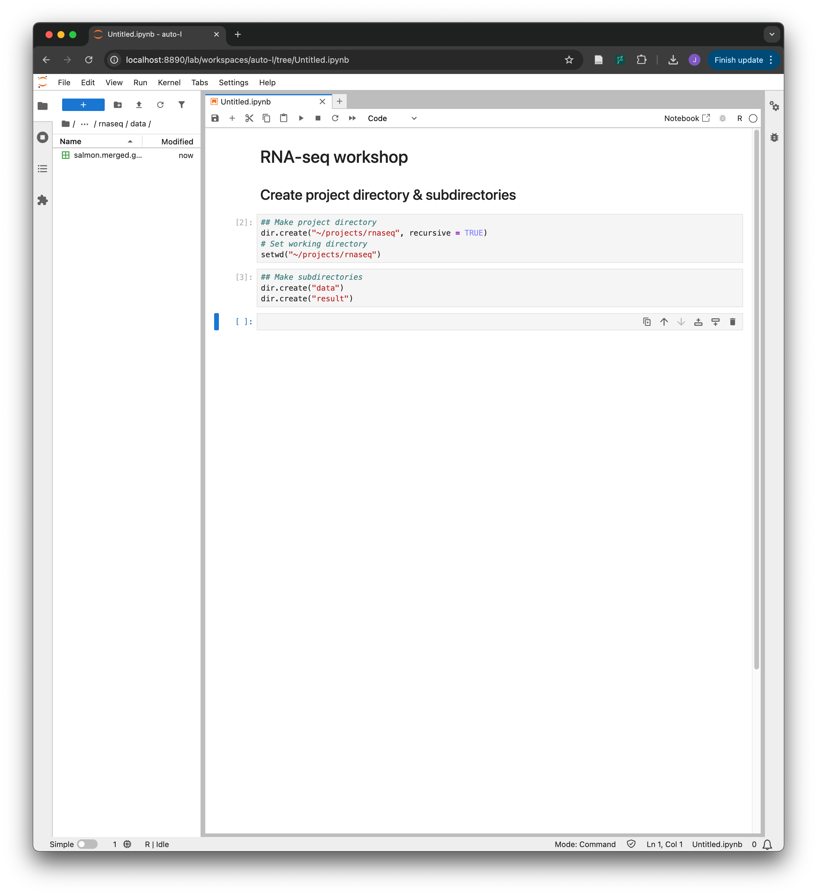

# Aristotle: Bioinformatics workshop taster

## Welcome to bioinformatics taster session!

In this session, we are going to learn:

1. What is a remote server
2. How to access a remote server (Aristotle)
3. How to download reference genome
4. How to get reference sequence of a gene
5. Practice


## 1. What is a remote server?

A **remote server** is a powerful computer located elsewhere that you can access over the internet. It has lots of storage and processing power, so it can handle big bioinformatics tasks like analyzing genomes, aligning sequences, and more.

You can connect to a remote server from your own computer (desktop or laptop) using tools like **SSH**, a secure login method. Once connected, you can run commands and programs on the server. In most cases, interacting with a remote server is done through the **command-line interface (CLI)**, which means there are no graphical icons — everything is typed as commands. (Don't panic!)

Now, let's get started. Open Terminal (macOS) or Powershell (Windows) on your computer as following.



Open **Windows PowerShell** as administrator.

<div align="left"><figure><figcaption></figcaption></figure></div>

<div align="left"><figure><figcaption></figcaption></figure></div>

<figure><figcaption></figcaption></figure>



Open **Terminal**.

<div align="left" data-full-width="true"><figure><figcaption></figcaption></figure></div>

<figure><figcaption></figcaption></figure>




## 2. Accessing UCL Aristotle

**UCL Aristotle** is a Linux-based compute service for practicing the command-line interface. Anyone with a UCL user ID and within the UCL institutional firewall can access Aristotle with the following command on **Terminal (macOS)** or **Powershell (Windows)**:

#### 2-1. Access Aristotle

Change `smgxxxx` into your UCL ID.

```bash
ssh smgxxxx@aristotle.rc.ucl.ac.uk
```

Once type the command, you will get the following question if you've never accessed Aristotle before:

```
The authenticity of host 'aristotle.rc.ucl.ac.uk (144.82.251.107)' can't be established.
ED25519 key fingerprint is SHA256:XXXXXXXXXXXXXXXXXXXXXXXXXXXXXXXXXXXXXXXXXX.
This key is not known by any other names.
Are you sure you want to continue connecting (yes/no/[fingerprint])? 
```

You can simply type `yes` in, then you'll be asked to enter your password:

```
smgxxxx@aristotle.rc.ucl.ac.uk's password: 
```

Type your UCL password in. **Nothing will appear on the screen** while typing—this is normal. Just type it and press enter.

If you enter it incorrectly, you’ll see:

```
Permission denied, please try again.
smgxxxx@aristotle.rc.ucl.ac.uk's password:
```

and you can try again.

Once the correct password is entered, you will now see the **bash prompt**, which usually starts with `bash-4.2$`:

<pre><code>Last failed login: Mon Jan 12 15:22:57 GMT 2026 from xx.xx.x.x on ssh:notty
There were 1 failed login attempts since the last successful login.
Last login: Thu Jan  8 13:33:07 2026 from xx.xx.x.x
-bash-4.2<a data-footnote-ref href="#user-content-fn-1">$</a> 
</code></pre>

This means you are now logged into Aristotle and can run commands on the remote server. Also, it's important to know that from now on, at any point following the instructions, you can use **Ctrl+C** to cancel the command.

<details>

<summary>If you’re unsure whether you’re using <code>bash</code></summary>

`bash` might not be the default shell on Aristotle. To check which shell you’re currently using, type:

```bash
 echo $0
```

This will display your current shell, for example: `sh`, `csh`, or `bash`.

To switch to Bash, simply type:

```bash
bash
```

and press **Enter**. Your prompt will now be in Bash.

</details>


## 3. Dowloading reference genome

We are going to download the reference genome (FASTA file: `*.fa`) and the annotation (GTF file: `*.gtf`).&#x20;

Reference genome is the raw DNA sequence of the genome, consisting of A, C, G, and Ts. It is used as a base when running various analyses.&#x20;

Annotation is a file that includes where genes, exons, transcripts, etc., are on the genome. It doesn't contain the actual sequence, but coordinates and gene IDs and so on.

To save disk space, we are going to download a chromosome from the reference genome. Feel free to change `CHR` into your desired chromosome. In addition, the downloaded files are going to be compressed, or **gzipped** (`*.gz`). We are going to unzip the reference genome file but not the annotation file.

#### 3-1. Make a reference genome directory under the home directory

```bash
## Make a reference directory under $HOME
mkdir -p $HOME/reference
```

#### 3-2. Move to the reference directory

```bash
## Change current directory into $HOME/reference
cd $HOME/reference
```

Now that we are in the directory, we can download the reference genome.

#### 3-3. Set the chromosome (1-22/X/Y)

Set the chromosome you want to download the reference sequence of.&#x20;

```bash
## Set the chromosome (1-22/X/Y)
CHR=22
```

#### 3-4. Download the reference genome

Save the compressed reference genome as `GRCh38.chr22.fa.gz`, for example, and decompress the file.

```bash
## Download the reference genome (sequence)
wget -O GRCh38.chr$CHR.fa.gz https://ftp.ensembl.org/pub/release-115/fasta/homo_sapiens/dna/Homo_sapiens.GRCh38.dna_sm.chromosome.$CHR.fa.gz
```

```bash
## Unzip the compressed fasta file
gzip -d GRCh38.*.fa.gz
```

#### 3-5. Download the annotation

Save the compressed annotation as `GRCh38.gtf.gz`.

```bash
## Download the annotation (gene position)
wget -O GRCh38.gtf.gz https://ftp.ensembl.org/pub/release-115/gtf/homo_sapiens/Homo_sapiens.GRCh38.115.chr.gtf.gz
```

#### 3-6. Index the fasta file

In many analyses, reference genome requires indexing for efficient access to any point in the file.&#x20;

Load `samtools` module to index the file.

```bash
## Load modules
module load gcc-libs samtools
```

```bash
## Index the fasta file
samtools faidx GRCh38.chr$CHR.fa
```

Now the reference genome is indexed, we are going to find the DNA sequence of a gene.


## 4. Extracting reference sequence of a gene&#x20;


Let's look up the coordinate of a gene we want. In this example, because we downloaded the reference genome of chromosome 22 earlier, _MCAT_ was chosen. However, feel free to set `GENE` into any gene that is on the chromosome you chose.&#x20;

#### 4-1. Set the name of the gene on the chromosome

```bash
## Set the gene name
GENE=MCAT
```

Now let's find the genomic position of the gene.

#### 4-2. Find a gene position from the annotation file

```bash
## Find the gene in the GTF file
zcat GRCh38.gtf.gz  | grep $GENE -m 1 -w -i 
```

```
22	ensembl_havana	gene	43132209	43143398	.	-	.	gene_id "ENSG00000100294"; gene_version "14"; gene_name "MCAT"; gene_source "ensembl_havana"; gene_biotype "protein_coding";
```

Now you see the coordinate for the gene on the first, the fourth, and the fifth column.

`22`: Chromosome

`43132209`: Gene start position

`43143398`: Gene end position

#### 4-3. Get the reference sequence of the gene

Now you can use `samtools faidx` to check the sequence. make the coordinate into **chr:start-end** format and add it at the end of the command like the example below.

```bash
samtools faidx GRCh38.chr$CHR.fa 22:43132209-43143398
```

```
>22:43132209-43143398
TTGGAATGTCTCATACTTAATATTGGCGCAGGAGCTGCTCTGAGGACGGGGCATGGAGCC
AGGGGTCAGCTCCGAGGCAGGTATGTGCTGTGCTCCCTCTGGCGCCCCGCAGACCCGCAG
TCCCAGTGGGTGACCAGGGTGTTCCTCCATGGTTCCACCCCTAGGACCAGGGCCTCAGTC
GCCCTCCCTACCTGGCACTCCCCACACCCCGCACCTCACTCAAGGACCTTTCTACCAGAA
...
CCTGGCTGCCCTGGCCCGGGAAGAGCAGCACGGAGCACTGGCCCGGCATTCGCCGCTCCG
TCGCCGCCCAGGGCGCCTCCTCCTCCGCCCCGGTCGCATCTCGCAGCAGCTCCGCTACAC
CCTGGGCGCCCGGCGGAGGCACCGGGAAGCTCGAGGCGCCGCGGCGGTAGCTGGCGCCCA
AGCCCCTGACCCACGCTACCCGTGCGACCCGGACGCTCATGGTCGGACACCTGCCCGCGC
GCGTTACCGTGGCGACCGAGGCCCGACTGC
```

Well done! This is the reference sequence of the gene of your interest.&#x20;


## 5. Practice

If you'd like to try by yourself, you can challenge yourself with these practice questions.

1. Get the coordinate of a gene whose gene ID is _ENSG00000141510_.
2. Download and index the chromosome which _ENSG00000141510_ is on.
3. Get the sequence of _ENSG00000141510_.
4. Did you find out what is the gene name of _ENSG00000141510_? Which file did you use to find it?

<details>

<summary>Solutions</summary>

1.

```bash
## Set the gene ID
GENE=ENSG00000141510
## Find the coordinate
zcat GRCh38.gtf.gz | grep $GENE -i -m 1 
```

```
17	ensembl_havana	gene	7661779	7687546	.	-	.	gene_id "ENSG00000141510"; gene_version "20"; gene_name "TP53"; gene_source "ensembl_havana"; gene_biotype "protein_coding";
```

2.

```bash
## Set the chromosome
CHR=17
## Download the reference genome of chromosome 17
wget -O GRCh38.chr$CHR.fa.gz https://ftp.ensembl.org/pub/release-115/fasta/homo_sapiens/dna/Homo_sapiens.GRCh38.dna_sm.chromosome.$CHR.fa.gz
## Decompress the FASTA file
gzip -d GRCh38.*.fa.gz

## Load samtools
module load gcc-libs samtools
## Index the fasta file
samtools faidx GRCh38.chr$CHR.fa
```

3.

```bash
samtools faidx GRCh38.chr$CHR.fa 17:7661779-7687546
```

```
>17:7661779-7687546
gagacagagtctcactctgttgcacaggctggagtgcagtggcacaatctctgctcactg
caacctcctcctccctggttaagagatcctcctgcctcagcccccttagtagctgggatt
acaggcgtgggccaccactgccaggctaatttttgtatttttagtagagatgggatttcg
ctatgttggccaggctgtcttgaactcctgacctcaggtgatccacctgccttggcctAA
...
ccccacccccagccccaGCGATTTTCCCGAGCTGAAAATACACGGAGCCGAGAGCCCGTG
ACTCAGAGAGGACTCATCAAGTTCAGTCAGGAGCTTACCCAATCCAGGGAAGCGTGTCAC
CGTCGTGGAAAGCACGCTCCCAGCCCGAACGCAAAGTGTCCCCGGAGCCCAGCAGCTACC
TGCTCCCTGGACGGTGGCTCTAGACTTTTGAGAAGCTCAAAACTTTTAGCGCCAGTCTTG
AGCACATGGGAGGGGAAAACCCCAATCC
```

4\.

TP53. When solving question 1, the annotation (GTF) file returned `gene_name` as well as `gene_id`.


</details>


Thank you for following! If you are interested, please consider participating in the [survey](https://forms.cloud.microsoft/e/3DQD321xMg), so that we can deliver optimized workshops for you.&#x20;


[^1]: Bash prompt
