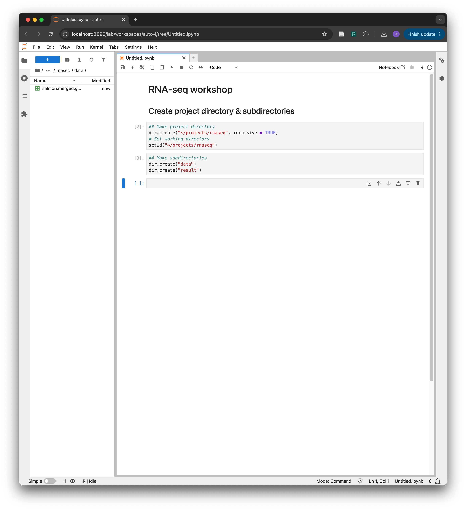

# Part 2: DESeq2: Differentially expressed genes identification

## 2. RNA-seq Analysis: Differential Expression

### Raw data

#### FASTQ: Raw sequence

When you sequence RNA, you typically obtain files in FASTQ format (e.g. `sample1_R1.fastq`, `sample1_R1.fastq.gz`, `sample1_R1.fq`, `sample1_R1.fq.gz`). This file format stores the raw sequencing reads along with their base quality scores.

<figure><figcaption></figcaption></figure>

These files do not contain information about where the sequences originate in the genome. To determine which genes the reads come from, they must be aligned (mapped) to a reference genome.

For example, think of the reference genome as a complete picture (like the Mona Lisa), and the raw reads as scattered puzzle pieces. Alignment software “assembles” these pieces by finding where each read best fits, assigning genomic coordinates and linking each read to its corresponding genomic location.

<figure><figcaption><p>Reference and unaligned reads</p></figcaption></figure>


<figure><figcaption><p>Reads aligned to the reference genome</p></figcaption></figure>

#### SAM/BAM: Sequence + Coordinates on genome

The aligned data is stored in SAM/BAM format (e.g. `sample1.sam`, `sample1.bam`). SAM is a human-readable text format, while BAM is its compressed binary equivalent. These files contain each read’s sequence along with its alignment information, including where it maps on the reference genome.

<figure><figcaption><p>BAM file opened on IGV</p></figcaption></figure>

Once the alignment is complete, you can count how many reads are mapped to each gene. In general, genes with higher expression levels will have more reads aligned to them, resulting in higher read counts.

However, raw gene-level read counts are influenced by factors such as sequencing depth and gene length, so they must be normalized before comparing expression levels across samples.

<figure><figcaption></figcaption></figure>

### Count table

<table data-full-width="false"><thead><tr><th>gene_name</th><th>Control1</th><th>Control2</th><th>Control4</th><th>Control5</th><th>Treated1</th><th>Treated2</th><th>Treated4</th><th>Treated5</th></tr></thead><tbody><tr><td>TSPAN6</td><td>1446</td><td>1588</td><td>1114</td><td>1805</td><td>1450</td><td>1062</td><td>1111</td><td>1426</td></tr><tr><td>TNMD</td><td>0</td><td>0</td><td>0</td><td>0</td><td>0</td><td>0</td><td>0</td><td>0</td></tr><tr><td>DPM1</td><td>535</td><td>471</td><td>729</td><td>624</td><td>696</td><td>445</td><td>637</td><td>677</td></tr><tr><td>SCYL3</td><td>141</td><td>199</td><td>153</td><td>147</td><td>154</td><td>174</td><td>120</td><td>160</td></tr><tr><td>FIRRM</td><td>44</td><td>61</td><td>72</td><td>98</td><td>96</td><td>57</td><td>62</td><td>40</td></tr><tr><td>FGR</td><td>0</td><td>0</td><td>0</td><td>0</td><td>0</td><td>0</td><td>0</td><td>0</td></tr><tr><td>CFH</td><td>3477</td><td>2822</td><td>3394</td><td>3552</td><td>2186</td><td>2140</td><td>1429</td><td>1207</td></tr><tr><td>FUCA2</td><td>3403</td><td>2248</td><td>3564</td><td>3138</td><td>3533</td><td>2375</td><td>2976</td><td>2576</td></tr><tr><td>GCLC</td><td>2355</td><td>1027</td><td>659</td><td>839</td><td>733</td><td>542</td><td>1108</td><td>648</td></tr></tbody></table>

Once read counting is complete, the data can be organized into a count table, where each row represents a gene and each column represents a sample (or, in single-cell RNA-seq, each column represents a cell). These are raw (absolute) gene counts across samples, and the software we will use today requires these raw counts—not normalized or scaled values—as input.

The count table is often saved as a CSV (comma-separated values) or TSV (tab-separated values) file, where columns are separated by commas (`,`) or tabs, respectively.

You can generate this table yourself by aligning raw sequencing reads to a reference genome. However, this process can take several hours and requires substantial computational resources, so for today’s session we will download a pre-generated count table and use it as input. This is typically what you receive when you send the samples for sequencing.



Please download the file above to your local computer for the next step.


### Running DESeq2

#### Set project directory

Now, let's run differential expression analysis using an R package DESeq2.&#x20;

Start by opening an R notebook and creating a project directory on your desktop.

```r
## Make project directory
dir.create("~/projects/rnaseq", recursive = TRUE)
# Set working directory
setwd("~/projects/rnaseq")
```

Make `data` directory to store the count table, and `result` directory to store DESeq2 run results.

```r
## Make subdirectories
dir.create("data")
dir.create("result")
```

Move the file explorer into the data directory and drag the `salmon.merged.gene_counts.tsv` file to move it into the directory. Move the file explorer back into the `rnaseq` directory and open an R notebook.

<figure><figcaption></figcaption></figure>

#### Install libraries

We will install a few R packages required for differential expression analysis.

First, create a directory for user-installed R packages (if it does not already exist), and ensure R uses this location:

```r
# Create directory for R libraries
dir.create(path = Sys.getenv("R_LIBS_USER"), showWarnings = FALSE, recursive = TRUE)
# Set library path
.libPaths(Sys.getenv("R_LIBS_USER"))
```

Next, install and load BiocManager if not already installed using the code below.&#x20;

**BiocManager** is an R package that provides a simple and reliable way to install and manage Bioconductor packages and their dependencies.&#x20;

```r
# Install BiocManager if not installed
if (!requireNamespace("BiocManager", quietly = TRUE)) {
  install.packages("BiocManager")
}
BiocManager::install(version = "3.22")

# Load BiocManager
library(BiocManager)
```

Now that BiocManager is installed, we will use it to install **DESeq2** and **org.Hs.eg.db**, which are, respectively, a package for differential expression analysis and a human gene annotation database. Similar to what we did before, please install these libraries on your system.

```r
# Install DESeq2 if not installed
if (!requireNamespace("DESeq2", quietly = TRUE)) {
  BiocManager::install("DESeq2")
}
# Install org.Hs.eg.db (human gene database) if not installed
if (!requireNamespace("org.Hs.eg.db", quietly = TRUE)) {
  BiocManager::install("org.Hs.eg.db", force=TRUE)
}
```

Once the installation is complete, load the `DESeq2` and `org.Hs.eg.db` libraries.

```r
# Load the libraries
library(DESeq2)
library(org.Hs.eg.db)
```

Now that the required libraries are installed and loaded, we can begin differential expression analysis.

#### Load data

We need two inputs for running DESeq2: `count_data` and `metadata`. They must be in the exact format required by DESeq2.

**Count data**

First, set the **file path** of your **count table**:

```r
# Set the file path
file1 <- 'data/salmon.merged.gene_counts.tsv' 
```

Using `read.csv` and, import the count table into `count_data`:

```r
# Read in raw gene count table and save it to count_data
count_data <- read.csv(file1, sep="\t", header=TRUE)
nrow(count_data)
head(count_data)
```

Since there are some pseudogenes that are duplicated in the dataset, we will remove duplicates; DESeq2 does not allow this in the input file:

```r
count_data <- count_data[!duplicated(count_data$gene_name), ]
nrow(count_data)
head(count_data)
```

Next, change the row names of the table to `gene_name` to match DESeq2 input format:

```r
rownames(count_data) <- count_data$gene_name
head(count_data)
```

Finally, remove the `gene_name` and `gene_id` columns to complete the input format:

```r
count_data = subset(count_data, select = -c(gene_name, gene_id))
head(count_data)
```

**Metadata**

We also need metadata, which specifies each sample’s condition (treated or control). In this example, since the sample names are `Control1`, `Treated1`, etc., we will remove the number at the end to create the condition information:

```r
# Generate metadata (contain sample names and conditions)
metadata <- data.frame(
	sample = colnames(count_data),  # sample name
	condition = sub("[0-9]+$", "", colnames(count_data)) # condition
)
metadata
```

Next, set the row names to the sample names, as required by DESeq2:

```r
# change rownames of metadata into sample names
rownames(metadata) <- metadata$sample 
metadata
```

With the input data prepared, we can now proceed to running DESeq2 on these data.

#### Run DESeq2

```r
# Convert count_data into appropriate format for DESeq2 run and save to dds
dds <- DESeqDataSetFromMatrix(countData = round(count_data), 
                              colData = metadata, 
                              design = ~ condition)
# Set Control group as refrence
dds$condition <- relevel(dds$condition, ref = "Control")    
# Run default DEG analysis with normalization                      
dds <- DESeq(dds)
# Extract differential expression of ALL the genes 
# (including the insignificant ones) to res
res <- results(dds)
# Omit any NA values in padj or log2FoldChange
res <- subset(res, !is.na(padj) & !is.na(log2FoldChange))
# Save the genes with Padj < 0.05 to sig_res (significant genes)
sig_res <- res[res$padj < 0.05,] 
```


#### Save data

```r
name='Treated_vs_Control'
of1 <- paste0("result/",name,"_DESeq2_Results.csv")
write.csv(res, of1, row.names = TRUE, quote = FALSE)
```

```r
of2 <- paste0("result/",name,"_DESeq2_Results_padj0.05.csv") 
write.csv(sig_res, of2, row.names = TRUE, quote = FALSE)
```

<figure><figcaption></figcaption></figure>

You can download the significant DEG table from `result` directory.


`Treated_vs_Control_DESeq2_Results_padj0.05.csv`

<table data-full-width="true"><thead><tr><th>gene</th><th>baseMean</th><th>log2FoldChange</th><th>lfcSE</th><th>stat</th><th>pvalue</th><th>padj</th></tr></thead><tbody><tr><td><strong>LMCD1</strong></td><td>130.116911</td><td><strong>2.6717296</strong></td><td>0.59349932</td><td>4.50165568</td><td>6.74E-06</td><td><strong>0.00987641</strong></td></tr><tr><td><strong>EDN1</strong></td><td>78.1486286</td><td><strong>5.03592727</strong></td><td>1.17566667</td><td>4.28346522</td><td>1.84E-05</td><td><strong>0.01717116</strong></td></tr><tr><td><strong>NOX4</strong></td><td>50.8925357</td><td><strong>4.63850252</strong></td><td>0.87965212</td><td>5.27311017</td><td>1.34E-07</td><td><strong>0.0006238</strong></td></tr><tr><td><strong>DHRS2</strong></td><td>17.2594646</td><td><strong>4.02682742</strong></td><td>0.92447889</td><td>4.35578084</td><td>1.33E-05</td><td><strong>0.01425229</strong></td></tr><tr><td><strong>MMP15</strong></td><td>1628.26954</td><td><strong>0.69259116</strong></td><td>0.16609922</td><td>4.16974346</td><td>3.05E-05</td><td><strong>0.02390385</strong></td></tr><tr><td><strong>XYLT1</strong></td><td>1624.5707</td><td><strong>2.4763288</strong></td><td>0.58203059</td><td>4.25463684</td><td>2.09E-05</td><td><strong>0.01865176</strong></td></tr></tbody></table>

