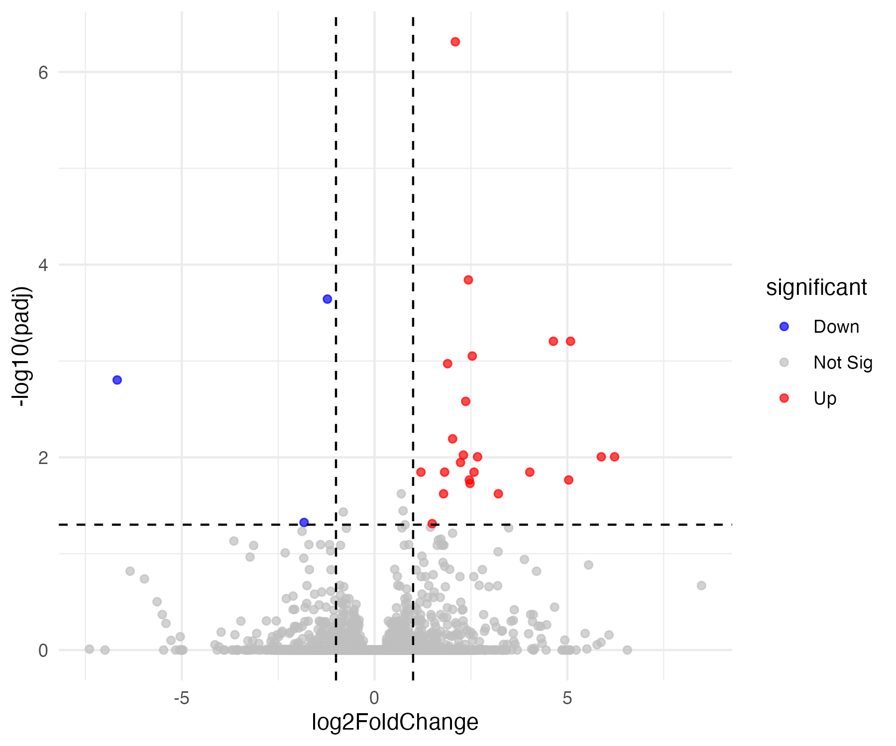

# Part 3: Visualizationm

### Heatmap

We will now generate a heatmap to visualize expression patterns of significant genes across samples.

Load the `pheatmap` package, which is used to draw heatmaps in R.

```r
# 3.1 Load pheatmap
library(pheatmap)
```

Extract the names of significantly differentially expressed genes from the results table.

```r
# 3.2 Get significant gene names
sig_genes <- rownames(sig_res)
sig_genes
```

Select only the significant genes from the count matrix for visualization.

```r
# 3.3 Extract the significant genes from the raw count data table
mat <- count_data
mat
```

Apply variance stabilizing transformation (`vst()`) to normalize the data and reduce dependence on sequencing depth.

```r
# 3.4 Normalize the raw counts
vsd <- vst(dds, blind = FALSE)
mat_norm <- assay(vsd)[sig_genes, ]
mat_norm
```

Scale each gene across samples so that differences in expression patterns are easier to visualize.

```r
# 3.5 Scale the normalized data
mat_scaled <- t(scale(t(mat_norm)))
mat_scaled
```

Generate a heatmap with clustering for both genes and samples.

```r
# 3.6 Plot a heatmap
pheatmap(mat_scaled,
         cluster_rows = TRUE, # genees
         cluster_cols = TRUE, # samples
         show_rownames = TRUE)
```

<figure><figcaption></figcaption></figure>

To save the heatmap in a png format, simply add `filename = 'result/heatmap_sig.png'` option.

```r
# 3.7 Plot a heatmap and save it into a png file
pheatmap(mat_scaled,
         cluster_rows = TRUE,
         cluster_cols = TRUE,
         show_rownames = TRUE,
         filename = "result/heatmap_sig.png")
```

You can download the heatmap from `result` directory.


### Volcano plot

We will create a volcano plot to visualize differential expression results, highlighting significant genes.

Load packages for plotting (`ggplot2`) and for adding non-overlapping labels (`ggrepel`).

```r
# 3.8 Load libraries
library(ggplot2)
library(ggrepel)
```

Classify genes into “Up”, “Down”, or “Not Sig” based on adjusted p-value and fold change thresholds and add it as a column in `res`.

```r
# 3.9 Add a column called "significance" and add significance information of each gene

## Set default as "Not Sig"
res$significance <- "Not Sig"

## Mark as "Up" if padj < 0.05 and log2FC > 1
res$significance[res$padj < 0.05 & res$log2FoldChange > 1] <- "Up"

## Mark as "Down" if padj < 0.05 and log2FC < -1
res$significance[res$padj < 0.05 & res$log2FoldChange < -1] <- "Down"
head(res)
head(res[res$significance == "Up",])
```

Plot fold change against statistical significance, with colors indicating gene categories and dashed lines showing thresholds.

```r
# 3.10 Plot a volcano plot
ggplot(res, aes(x = log2FoldChange, y = -log10(padj), color = significance)) +
  geom_point(alpha = 0.7) +
  scale_color_manual(values = c("blue", "grey", "red")) +
  theme_minimal() +
  geom_vline(xintercept = c(-1, 1), linetype = "dashed") +
  geom_hline(yintercept = -log10(0.05), linetype = "dashed")
```

<figure><figcaption></figcaption></figure>

Select the most significant genes (lowest adjusted p-values) and stores their names for labeling on the plot. In this example, all the genes with padj < 0.05 was used, but you can change the number of genes you want to show label of by changing `nrow(sig_res)` into the desired number.

```r
# 3.11 Get the list of genes with padj < 0.05 for labeling
top <- res[order(res$padj), ][1:nrow(sig_res), ]
top$gene <- rownames(top)
```

Add labels to the genes with padj < 0.05 while preventing overlap, making key genes easier to identify.

```r
# 3.12 Plot volcano plot with the significant genes label
ggplot(res, aes(x = log2FoldChange, y = -log10(padj), color = significance)) +
  geom_point(alpha = 0.7) +
  scale_color_manual(values = c("blue", "grey", "red")) +
  theme_minimal() +
  geom_vline(xintercept = c(-1, 1), linetype = "dashed") +
  geom_hline(yintercept = -log10(0.05), linetype = "dashed")+
  geom_point(alpha = 0.7) +
  geom_text_repel(data = top, aes(label = gene), size = 3) 
```

<figure><figcaption></figcaption></figure>

Save the volcano plot in the `result` directory.

```r
# 3.13 Save the volcano plot
ggsave("result/volcano_plot_sig.png", width = 6, height = 5, dpi = 300)
```


Well done! You can find the tables and plots you genereated in the `projects/rnaseq/result` directory.

<figure><figcaption></figcaption></figure>

Also, don't forget to save the notebook for reproducibility.

```
projects/rnaseq/deseq2_workshop.ipynb
```

<figure><figcaption></figcaption></figure>

<figure><figcaption></figcaption></figure>

