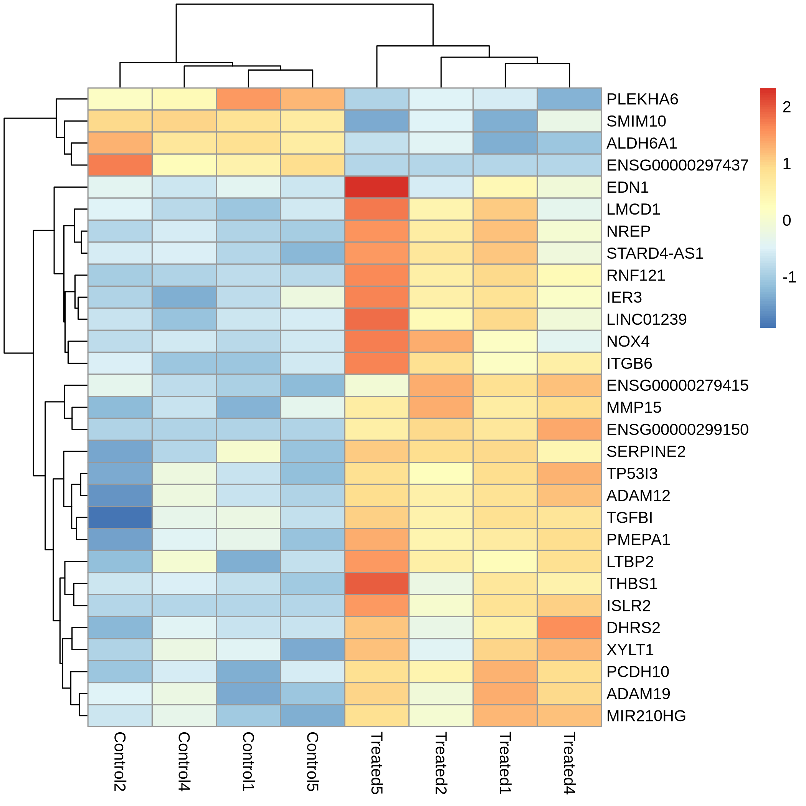
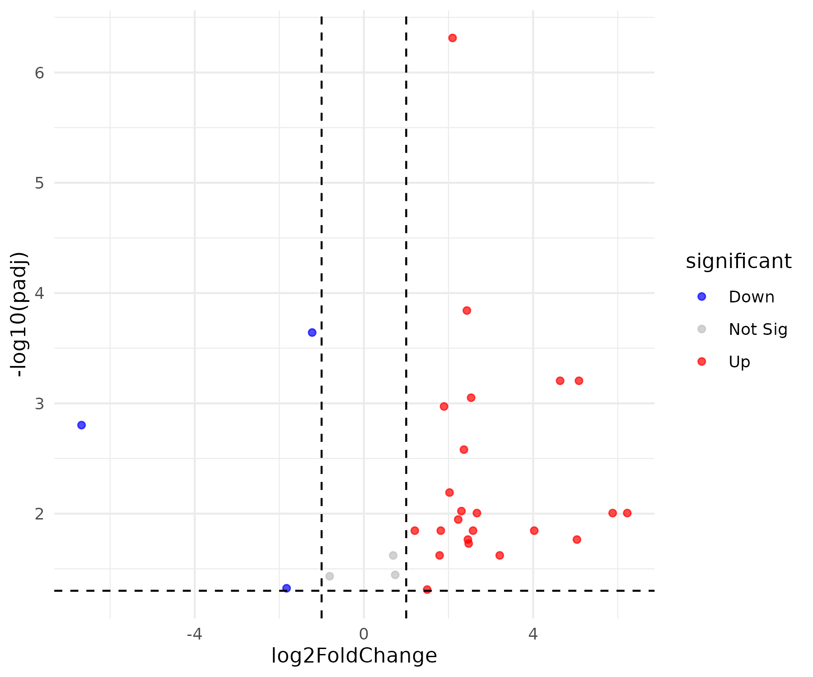

# Part 3: Visualization

### Heatmap

We are now going to draw heatmap&#x20;

```r
# Install pheatmap if not installed
if (!requireNamespace("pheatmap", quietly = TRUE)) {
  BiocManager::install("pheatmap", force=TRUE)
}
```

```
library(pheatmap)
```


```r
# Get significant gene names
sig_genes <- rownames(sig_res)
sig_genes
```

```r
# Extract the significant genes from the raw count data table
mat <- count_data[sig_genes, ]
mat
```

To generate a heatmap, you can't use&#x20;

```r
# Normalize the raw counts
vsd <- vst(dds, blind = FALSE)
mat_norm <- assay(vsd)[sig_genes, ]
mat_norm
```


```r
# Scale the normalized data
mat_scaled <- t(scale(t(mat_norm)))
mat_scaled
```


```r
# Draw heatmap
pheatmap(mat_scaled,
         cluster_rows = TRUE, # genees
         cluster_cols = TRUE, # samples
         show_rownames = TRUE)
```

<figure><figcaption></figcaption></figure>


To save the heatmap in a png format, simply add `filename = 'result/heatmap_sig.png'` option.

```r
pheatmap(mat_scaled,
         cluster_rows = TRUE,
         cluster_cols = TRUE,
         show_rownames = TRUE,
         filename = "result/heatmap_sig.png")
```


### Volcano plot

```r
# Install ggplot2 if not installed
if (!requireNamespace("ggplot2", quietly = TRUE)) {
  BiocManager::install("ggplot2", force=TRUE)
}
# Install ggrepel if not installed
if (!requireNamespace("ggrepel", quietly = TRUE)) {
  BiocManager::install("ggrepel", force=TRUE)
}
```


```r
library(ggplot2)
library(ggrepel)
```


```r
sig_res$significant <- "Not Sig"
sig_res$significant[sig_res$padj < 0.05 & sig_res$log2FoldChange > 1] <- "Up"
sig_res$significant[sig_res$padj < 0.05 & sig_res$log2FoldChange < -1] <- "Down"

ggplot(sig_res, aes(x = log2FoldChange, y = -log10(padj), color = significant)) +
  geom_point(alpha = 0.7) +
  scale_color_manual(values = c("blue", "grey", "red")) +
  theme_minimal() +
  geom_vline(xintercept = c(-1, 1), linetype = "dashed") +
  geom_hline(yintercept = -log10(0.05), linetype = "dashed")
```

<figure><figcaption></figcaption></figure>

```r

top10 <- sig_res[order(res_df$padj), ][1:10, ]

ggplot(sig_res, aes(x = log2FoldChange, y = -log10(padj), color = significant)) +
  geom_point(alpha = 0.7) +
  scale_color_manual(values = c("blue", "grey", "red")) +
  theme_minimal() +
  geom_vline(xintercept = c(-1, 1), linetype = "dashed") +
  geom_hline(yintercept = -log10(0.05), linetype = "dashed")+
  geom_point(alpha = 0.7) +
  geom_text_repel(data = top10, aes(label = gene), size = 3) 
```


<figure><figcaption></figcaption></figure>

```r
ggsave("result/volcano_plot_sig.png", width = 6, height = 5, dpi = 300)
```
