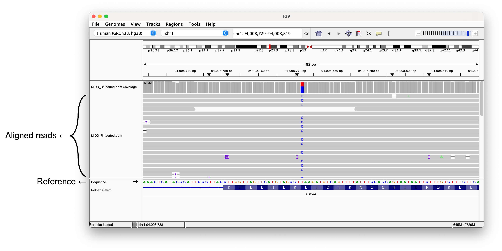

# Introduction to RNA-seq Analysis

Welcome to the Bioinformatics Hub workshop! In this session, we will explore a typical RNA-seq analysis workflow and set up the computational environment needed to run it.

To run the analysis, we will need an environment for running R code. For this, we will download and install [**Jupyter**](https://jupyter.org/) on your laptops. To begin, please open **Terminal (Mac)** or **PowerShell (Windows)**.

## 1. Jupyter setup

### Install Miniconda

To install JupyterLab, you need `conda`.&#x20;

Conda is a tool that helps you install and manage software and their dependencies in **isolated environments**, so different tools don’t interfere with each other.

Download and install **Miniconda** from the installer from the [Conda documentation](https://docs.conda.io/projects/conda/en/latest/index.html). After installation, restart your terminal (Terminal on macOS or PowerShell on Windows).&#x20;

You should now see `(base)` at the beginning of your command line.&#x20;

<figure><figcaption></figcaption></figure>

This indicates that Conda is installed and the base environment is active.

### Create a new environment for JupyterLab

Instead of installing everything in the base environment, we will create a separate environment named `jupyter` for JupyterLab:

```bash
conda create -n jupyter -c conda-forge \
  python=3.11 \
  jupyterlab \
  r-base \
  r-irkernel \
  r-essentials -y
```

#### During installation

You may be prompted to confirm the installation.

<figure><figcaption></figcaption></figure>

* Type `a` in and press enter twice to proceed.

<figure><figcaption></figcaption></figure>

* Type `y` and press enter to proceed.

Once the installation is complete, you will see messages like:

<figure><figcaption></figcaption></figure>

Run the following code to actiavate the new environment.

```
conda activate jupyter
```

<figure><figcaption></figcaption></figure>

Now you are in `jupyter` environment, as you can tell from `(jupyter)` at the beginning of the prompt.

Run JupyterLab:

```bash
jupyter lab
```

A browser window should open automatically showing the JupyterLab interface.

If it does not open, check the terminal for a URL (including a port number), for example:

<figure><figcaption></figcaption></figure>

```
http://localhost:8888
```

Then copy and paste this address into your browser.

#### JupyterLab interface

You should now see the JupyterLab home page.

* The **left panel** is the file explorer
* On the **right-hand side**, you can create a new notebook

<figure><figcaption></figcaption></figure>

To start a terminal, click **Terminal**.

<figure><figcaption></figcaption></figure>

To start an R notebook, click **R**.

<figure><figcaption></figcaption></figure>

You can type your code into the cells and press **Shift + Enter** to run it.


## 2. RNA-seq Analysis: Differential Expression

### Raw data

#### FASTQ: Raw sequence

When you sequence RNA, you typically obtain files in FASTQ format (e.g. `sample1_R1.fastq`, `sample1_R1.fastq.gz`, `sample1_R1.fq`, `sample1_R1.fq.gz`). This file format stores the raw sequencing reads along with their base quality scores.

<figure><figcaption></figcaption></figure>

These files do not contain information about where the sequences originate in the genome. To determine which genes the reads come from, they must be aligned (mapped) to a reference genome.

For example, think of the reference genome as a complete picture (like the Mona Lisa), and the raw reads as scattered puzzle pieces. Alignment software “assembles” these pieces by finding where each read best fits, assigning genomic coordinates and linking each read to its corresponding genomic location.

<figure><figcaption><p>Reference and unaligned reads</p></figcaption></figure>


<figure><figcaption><p>Reads aligned to the reference genome</p></figcaption></figure>

#### SAM/BAM: Sequence + Coordinates on genome

The aligned data is stored in SAM/BAM format (e.g. `sample1.sam`, `sample1.bam`). SAM is a human-readable text format, while BAM is its compressed binary equivalent. These files contain each read’s sequence along with its alignment information, including where it maps on the reference genome.

<figure><figcaption><p>BAM file opened on IGV</p></figcaption></figure>

Once the alignment is complete, you can count how many reads are mapped to each gene. In general, genes with higher expression levels will have more reads aligned to them, resulting in higher read counts.

However, raw gene-level read counts are influenced by factors such as sequencing depth and gene length, so they must be normalized before comparing expression levels across samples.

<figure><figcaption></figcaption></figure>

### Count table

<table data-full-width="false"><thead><tr><th>gene_name</th><th>Control1</th><th>Control2</th><th>Control4</th><th>Control5</th><th>Treated1</th><th>Treated2</th><th>Treated4</th><th>Treated5</th></tr></thead><tbody><tr><td>TSPAN6</td><td>1446</td><td>1588</td><td>1114</td><td>1805</td><td>1450</td><td>1062</td><td>1111</td><td>1426</td></tr><tr><td>TNMD</td><td>0</td><td>0</td><td>0</td><td>0</td><td>0</td><td>0</td><td>0</td><td>0</td></tr><tr><td>DPM1</td><td>535</td><td>471</td><td>729</td><td>624</td><td>696</td><td>445</td><td>637</td><td>677</td></tr><tr><td>SCYL3</td><td>141</td><td>199</td><td>153</td><td>147</td><td>154</td><td>174</td><td>120</td><td>160</td></tr><tr><td>FIRRM</td><td>44</td><td>61</td><td>72</td><td>98</td><td>96</td><td>57</td><td>62</td><td>40</td></tr><tr><td>FGR</td><td>0</td><td>0</td><td>0</td><td>0</td><td>0</td><td>0</td><td>0</td><td>0</td></tr><tr><td>CFH</td><td>3477</td><td>2822</td><td>3394</td><td>3552</td><td>2186</td><td>2140</td><td>1429</td><td>1207</td></tr><tr><td>FUCA2</td><td>3403</td><td>2248</td><td>3564</td><td>3138</td><td>3533</td><td>2375</td><td>2976</td><td>2576</td></tr><tr><td>GCLC</td><td>2355</td><td>1027</td><td>659</td><td>839</td><td>733</td><td>542</td><td>1108</td><td>648</td></tr></tbody></table>

Once read counting is complete, the data can be organized into a count table, where each row represents a gene and each column represents a sample (or, in single-cell RNA-seq, each column represents a cell). These are raw (absolute) gene counts across samples, and the software we will use today requires these raw counts—not normalized or scaled values—as input.

The count table is often saved as a CSV (comma-separated values) or TSV (tab-separated values) file, where columns are separated by commas (`,`) or tabs, respectively.

You can generate this table yourself by aligning raw sequencing reads to a reference genome. However, this process can take several hours and requires substantial computational resources, so for today’s session we will download a pre-generated count table and use it as input. This is typically what you receive when you send the samples for sequencing.




### Running DESeq2

Now, let's run differential expression analysis using an R package DESeq2.&#x20;

Start by making a project directory on your desktop.

```bash
## Make project directory
mkdir -p $HOME/projects/rnaseq
## Change into the project directory
cd $HOME/projects/rnaseq
```

Make `data` directory to store the count table, and `result` directory to store DESeq2 run results.

```bash
## Make subdirectories
mkdir data
mkdir result
```

Move the file explorer into the data directory and drag the `salmon.merged.gene_counts.tsv` file to move it into the directory. Move the file explorer back into the `rnaseq` directory and open an R notebook.

<figure><figcaption></figcaption></figure>

#### Install libraries

We need a couple of libraries for differentially expressed genes (DEGs) identification.&#x20;

```r
## Create directory for R libraries
dir.create(path = Sys.getenv("R_LIBS_USER"), showWarnings = FALSE, recursive = TRUE)
```

```r
# Install BiocManager if not installed
if (!requireNamespace("BiocManager", quietly = TRUE)) {
  install.packages("BiocManager", lib = Sys.getenv("R_LIBS_USER"))
}
BiocManager::install(version = "3.22")
library(BiocManager)
```

```r
# Install DESeq2 if not installed
if (!requireNamespace("DESeq2", quietly = TRUE)) {
  BiocManager::install("DESeq2", lib = Sys.getenv("R_LIBS_USER"))
}
# Install org.Hs.eg.db (human gene database) if not installed
if (!requireNamespace("org.Hs.eg.db", quietly = TRUE)) {
  BiocManager::install("org.Hs.eg.db", lib = Sys.getenv("R_LIBS_USER"), force=TRUE)
}
```

```r
# Load the libraries
library(DESeq2)
library(org.Hs.eg.db)
library(clusterProfiler)
```

## 3. Visualization

### Heatmap

### Volcano plot


